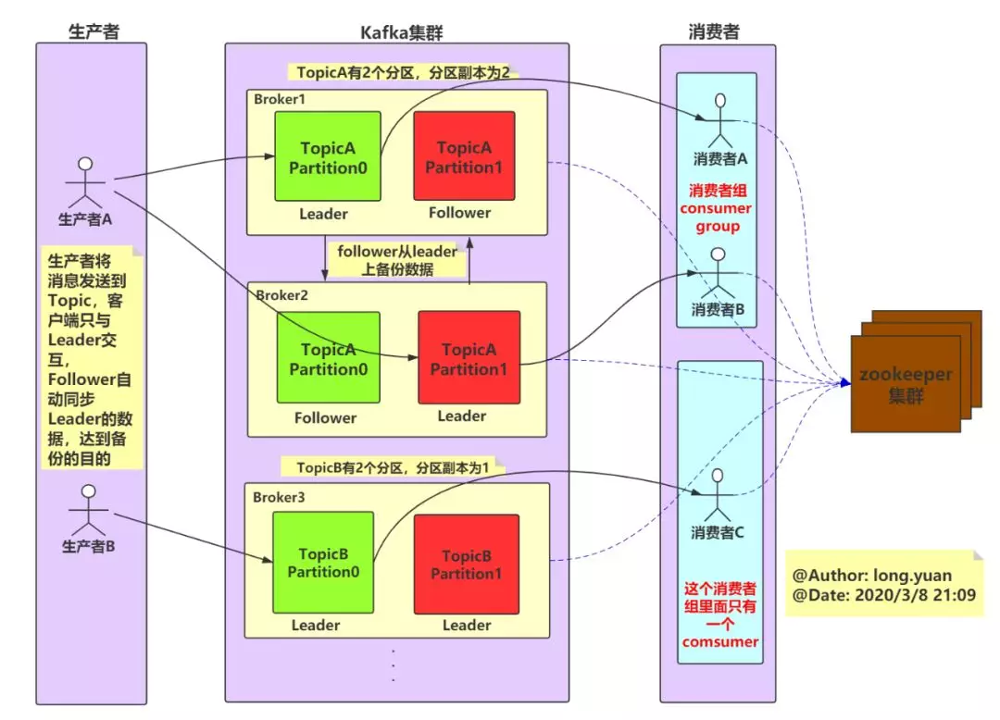
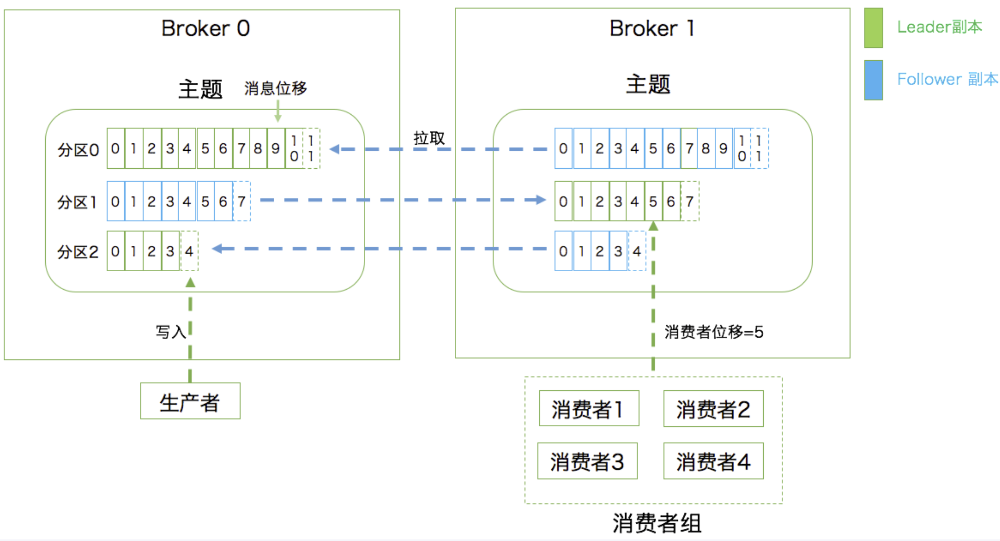

### kafka的架构图

- ### 	Producer（生产者）

​		消息生产者，就是向broker发指定topic消息的客户端
​		客户端（Clients）

- ### 	Consumer（消费者）

​		消息消费者，通过订阅一组topic的消息，从broker读取消息的客户端
​		客户端（Clients）

- ### 	Broker

​		一个kafka集群包含一个或多个服务器，一台kafka服务器就是一个broker，用于保存producer发送的消息。一个broker可以容纳多个topic。
​			Broker 负责接收和处理客户端发送过来的请求，以及对消息进行持久化。
​			常见的做法是将不同的 Broker 分散运行在不同的机器上(高可用)

- ### 		备份机制（Replication）高可用

​			领导者副本（Leader Replica）
​				对外提供服务
​				生产者总是向领导者副本写消息
​				消费者总是从领导者副本读消息

​			追随者副本（Follower Replica）
​				被动地追随领导者副本(不对外）
​				MySQL 的从库是可以处理读操作的
​				向领导者副本发送请求

- ### 	Topic（主题）

​		每条发送到broker的消息都有一个类别，可以理解为一个队列或者数据库的一张表

- ### 	Partition（分区）

​		一个topic的消息由多个partition队列存储的，一个partition队列在kafka上称为一个分区。每个partition是一个有序的队列，多个partition间则是无序的。partition中的每条消息都会被分配一个有序的id（offset）。
​			把数据分割成多份保存在不同的 Broker 上
​			每个主题划分成多个分区（Partition），每个分区是一组有序的消息日志

- ### 	Consumer Group （CG 消费者组）

​		若干个Consumer组成的集合

- ### 	Consumer Offset （消费者位移）

​		每个消费者在消费消息的过程中必然需要有个字段记录它当前消费到了分区的哪个位置上

- ### 	Record（消息）

​		Kafka 处理的主要对象

- ### 	Offset（消息位移）

​		偏移量。kafka为每条在分区的消息保存一个偏移量offset，这也是消费者在分区的位置。kafka的存储文件都是按照offset.kafka来命名，位于2049位置的即为2048.kafka的文件。比如一个偏移量是5的消费者，表示已经消费了从0-4偏移量的消息，下一个要消费的消息的偏移量是5。

- ### 	Replica（副本）

- ### 	Rebalance（重平衡）

### 	术语理解图

