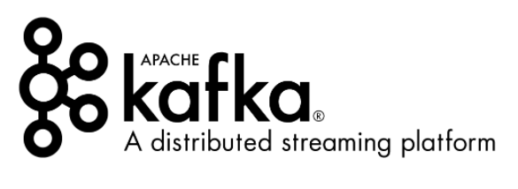

### Kafka是什么？

Kafka最初由Linkedin公司开发，是一个**分布式的、分区的、多副本的、多订阅者**，基于zookeeper协调的分布式日志系统（也可以当做MQ系统），常用于**web/nginx日志、访问日志、消息服务**等等。

### 为什么有Kafka?

LinkedIn公司处理业务系统和应用程序性能监控，以及用户行为数据处理。

起初目标是：

- 提供一套 API 实现生产者和消费者；
- 降低网络传输和磁盘存储开销；
- 实现高伸缩性架构。

迭代后目标是：

- 一个系统流入 Kafka 然后再流向下游的另一个系统（流处理组件 Kafka Streams）

### **kafka的应用场景**

- **日志收集**：一个公司可以用Kafka收集各种服务的log，通过kafka以统一接口开放给各种消费端，例如hadoop、Hbase、Solr等。
- **消息系统**：解耦生产者和消费者、缓存消息等。
- **用户活动跟踪**：Kafka经常被用来记录web用户或者app用户的各种活动，如浏览网页、搜索记录、点击等活动，这些活动信息被各个服务器发布到kafka的topic中，然后订阅者通过订阅这些topic来做实时的监控分析，或者装载到hadoop、数据仓库中做离线分析和挖掘。
- **运营指标**：Kafka也经常用来记录运营监控数据。
- **流式处理**

### Kafka 种类

#### [Apache Kafka](http://kafka.apache.org)

特点：只有最基础的组件，监控组件也需要第三方支持（Kafka manager）

适合场景：仅需要一个消息引擎系统亦或是简单的流处理应用场景，同时需要对系统有较大把控度

#### [Confluent Kafka](https://www.cloudera.com/) 

特点：

- Confluent Platform是大数据的ETL工具，基于Kafka
- 免费版有 Schema 注册中心和 REST proxy 两大功能

​			       *Schema 注册中心 -- 管理 Kafka 消息格式以实现数据前向 / 后向兼容*

​                   *REST proxy -- 开放 HTTP 接口的方式允许你通过网络访问 Kafka 的各种功能*

- 国内使用很少

适合场景：只需要使用上面提供两个功能，又不想重新二次开发

](basic-introduction.assets/cloudera-newco-logo.png)

#### [Cloudera/Hortonworks Kafka](Cloudera/Hortonworks Kafka)

特点：开源，功能齐全，与kafka代码同步慢。

适合场景：使用Cloudera整体方案的时候（小规模大数据方案）

​                    Cloudera是在Hadoop生态系统中，规模最大、知名度最高的公司

#### [阿里云 Kafka](https://help.aliyun.com/document_detail/68151.html)

特点：功能齐全，性价比高

适合场景：使用阿里云整体方案的时候

### 类似系统对比

消息引擎方面

ActiveMQ

实时流处理平台

Apache Storm

Apache Spark

Apache Flink

