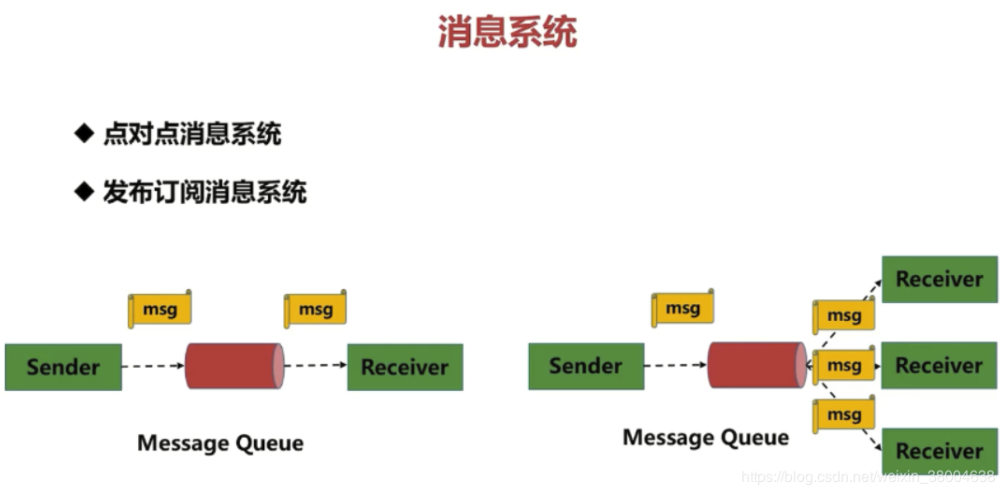

- ### 什么是消息系统(又叫：消息引擎系统)

  消息引擎系统是一组规范。企业利用这组规范在不同系统之间**传递**语义准确的**消息**，实现松耦合的异步式数据传递。

  

- ### 传输协议

  1. 点对点模型

  2. 发布 / 订阅模型

     

  #### 点对点模型

  点对点指的是同一条消息只能被下游的一个消费者消费。

  ```
  生产者发送一条消息到queue，一个queue可以有很多消费者，但是一个消息只能被一个消费者接受，当没有消费者可用时，这个消息会被保存直到有 一个可用的消费者，所以Queue实现了一个可靠的负载均衡。
  ```

  #### 发布 / 订阅模型

  发布者发送到topic的消息，只有订阅了topic的订阅者才会收到消息。topic实现了发布和订阅，当你发布一个消息，所有订阅这个topic的服务都能得到这个消息，所以从1到N个订阅者都能得到这个消息的拷贝。


