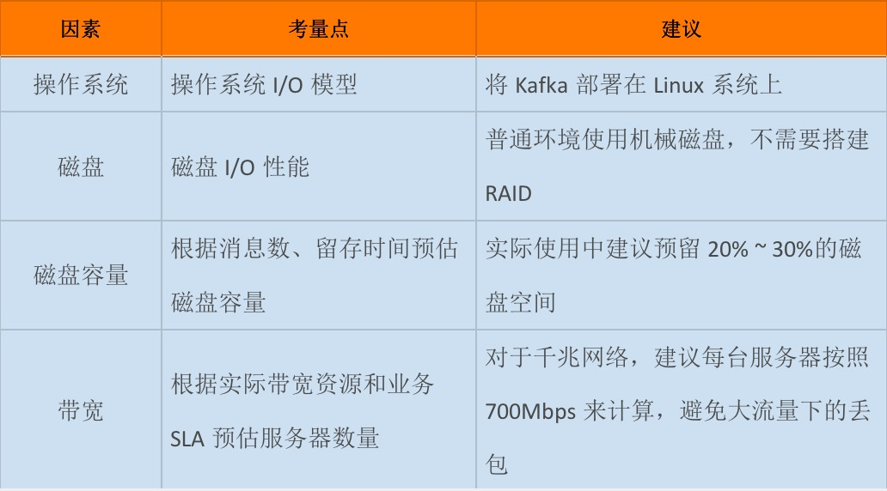

分享主题：

# Kafka介绍、实践、展望


## 介绍


### 消息系统模式


### Apache Kafka介绍

Apache Kafka是一种分布式的、基于发布/订阅的消息系统，由Scala语言编写而成。具备快速、可扩展、可持久化的特点为。


#### Kafka术语

**Producer（生产者）**

```
消息生产者，就是向broker发指定topic消息的客户端 客户端（Clients）
```

**Consumer（消费者）**

```
消息消费者，通过订阅一组topic的消息，从broker读取消息的客户端 客户端（Clients）
```

**Broker** （保存消息）

```
 一个kafka集群包含一个或多个服务器，一台kafka服务器就是一个broker，用于保存producer发送的消息。一个broker可以容纳多个topic。 Broker 负责接收和处理客户端发送过来的请求，以及对消息进行持久化。 常见的做法是将不同的 Broker 分散运行在不同的机器上(高可用)
```

备份机制（Replication）高可用Topic（主题）

```
 领导者副本，追随者副本
```

**Topic（主题）**消息类别


Partition（分区）

```
一个topic的消息由多个partition队列存储
```

Consumer Group （CG 消费者组）

```
 若干个Consumer组成的集合，同一条消息一个消费者组只能消费一次。
```

Consumer Offset （消费者位移）

**Record（消息）**

Offset（消息位移）
Replica（副本）
Rebalance（重平衡）

pull与push


整体理解


### Kafka 种类

#### [**Apache** Kafka](http://kafka.apache.org)


```
   特点：只有最基础的组件，监控组件也需要第三方支持（Kafka manager）

适合场景：仅需要一个消息引擎系统亦或是简单的流处理应用场景，同时需要对系统有较大把控度
```


#### [Confluent Kafka](https://www.cloudera.com/) 


```
特点：

- Confluent Platform是大数据的ETL工具，基于Kafka
- 免费版有 Schema 注册中心和 REST proxy 两大功能
- Schema 注册中心 -- 管理 Kafka 消息格式以实现数据前向 / 后向兼容
- REST proxy -- 开放 HTTP 接口的方式允许你通过网络访问 Kafka 的各种功能
- 国内使用很少

适合场景：只需要使用上面提供两个功能，又不想重新二次开发
```


[Cloudera/Hortonworks Kafka](Cloudera/Hortonworks Kafka)


```
   特点：开源，功能齐全，与kafka代码同步慢。

适合场景： - 使用Cloudera整体方案的时候（小规模大数据方案）
         - Cloudera是在Hadoop生态系统中，规模最大、知名度最高的公司


```


#### [阿里云 Kafka](https://help.aliyun.com/document_detail/68151.html)

特点：功能齐全，性价比高

适合场景：使用阿里云整体方案的时候


### 特点

- Kafka使用磁盘但高效地存储消息和查询消息。
  - 顺序读写的方式访问磁盘
- Kafka支持批量读写消息，可压缩（占用更少网络、磁盘）
  - 生产者压缩
  - 消息者解压
- 消息分区，在线水平扩展
  - 增加并发操作
  - 动态水平扩展
- 建立副本
  - 容灾


### 应用场景

- #### 消息中间件

- #### 数据流转

- #### 日志中心

  - 离线数据处理
  - 实时数据处理（流式处理）

- #### 用户活动跟踪

- #### 运营指标

- #### 数据同步工具

- #### 分布式文件系统？

  - 由顺序读写特性效率也不低，作为分布式文件系统尝试


### 横向对比


#### MQTT与kafka对比分析

| #                                                            |                                                              |                                                              |      |
| ------------------------------------------------------------ | ------------------------------------------------------------ | ------------------------------------------------------------ | ---- |
| 名称                                                         | MQTT                                                         | Kafka                                                        |      |
| 历史                                                         | IBM推出的一种针对移动终端设备的发布/预订协议。               | Linkedln公司开发的分布式发布-订阅消息系统。后来，成为Apache项目的一部分。 |      |
| 原理                                                         | 基于二进制消息惇发布/订阅编程模式的消息协议。                | 发布/订阅(Publish/Subscribe)模式                             |      |
| 应用场景                                                     | 物联网︰大量计算能力有限，且工作在低带宽、不可靠的网络的远程传感器和控制设备通讯而设计的协议。<br/>遥感数据<br/>汽车<br/>智能家居<br/>智慧城市<br/>医疗医护 | 在线应用（消息）和离线应用（数据文件,日志）<br/>1.消息系统(吞吐量，内置的分区，冗余及容错性）<br/>2.行为跟踪（户浏览页面、搜索及其他行为）<br/>3.日志收集（抽象成一个个日志或事件的消息流） |      |
| 消息消费(push/pull)                                          |  |  |      |
| 主题(Topic)                                                  | 主题筛选器︰通过主题对消息进行分类的层级主题︰通过反斜杠表示多个层级关系;<br/>通过通配符进行过滤︰+可以过滤一个层级，而*只能出现在主题最后表示过滤任意级别的层级。举个例子:<br/>building-b/floor-5:代表B楼5层的设备。<br/>+/floor-5:代表任何一个楼的5层的设备。<br/>building-b/*︰代表B楼所有的设备。<br/>注意，MQTT允许使用通配符订阅主题，但是并不允许使用通配符广播。 | 每个topic划分为多个partition。<br/>每个partition在存储层面是append log文件。 |      |
| 服务质量(Qualityof Service，QoS)                             | 三种可靠性选项:<br/>·级别0 :尽力而为。消息可能会丢，但绝不会重复传输<br/>·级别1∶消息绝不会丢，但可能会重复传输<br/>级别2:恰好一次。每条消息肯定会被传输一次且仅传输一次 | 级别1，Kafka利用这一特点减少确认从而大大提高了并发。         |      |
| 存储方式                                                     | 内存、redis、mongdb等                                        | 磁盘                                                         |      |
| 8.设计原则(为什么MQTT用来做物联网消息传输、Kafka用来<br/>做日志收集) | 1.协议精简，不添加可有可无的功能。<br/>⒉发布/订阅(Pub/Sub)模式，方便消息在传感器之间传递。<br/>3.允许用户动态创建主题，零运维成本。<br/>4.把传输量降到最低以提高传输效率。(固定长度的头部是2字节)，协议交换最小化，以降低网络流量。5.把低带宽、高延迟、不稳定的网络等因素考虑在内。6.支持连续的会话控制。<br/>7.理解客户端计算能力可能很低。8.提供服务质量管理。<br/>9.假设数据不可知，不强求传输数据的类型与格式，保持灵活性。 | 吞吐量<br/>1.数据磁盘持久化:消息不在内存中cache，直接写入<br/>到磁盘，充分利用磁盘的顺序读写性能<br/>2.zero-copy:减少IO操作步骤3.数据批量发送<br/>4.数据压缩<br/>5.Topic划分为多个partition，提高parallelism<br/>负载均衡<br/>1.生产者发送消息到pattition<br/>⒉存在多个partiiton，每个partition有自己的replica,每个replica分布在不同的Broker节点上<br/>3.多个partition需要选取出lead partition，leadpartition负责读写，并由zookeeper负责fail over<br/>4.通过zookeeper管理broker与consumer的动态加入与离开<br/>拉取系统<br/>kafka broker会持久化数据，consumer采取pull的方式消费数据:<br/>1.consumer根据消费能力自主控制消息拉取速度2.consumer根据自身情况自主选择消费模式，例如批<br/>量，重复消费，从尾端开始消费等<br/>可扩展性<br/>当需要增加broker结点时，新增的broker会向zookeeper注册，而producer及consumer会根据注册在zookeeper上的watcher感知这些变化，并及时作出调整。 |      |
| 9.消息类型                                                   | 1.CONNECT:客户端连接到MQTT代理<br/>2.CONNACK:连接确认<br/>3.PUBLISH:新发布消息<br/>4.PUBACK:新发布消息确认，是QoS 1给PUBLISH消息的回复<br/>5.PUBREC: QoS2消息流的第一部分，表示消息发布已记录<br/>6.PUBREL: QoS2消息流的第二部分，表示消息发布已释放<br/>7.PUBCOMP: QoS 2消息流的第三部分，表示消息发布完成<br/>8.SUBSCRIBE:客户端订阅某个主题<br/>9.SUBACK:对于SUBSCRIBE消息的确认<br/>10.UNSUBSCRIBE:客户端终止订阅的消息<br/>11.UNSUBACK:对于UNSUBSCRIBE消息的确认<br/>12.PINGREQ:心跳<br/>13.PINGRESP:确认心跳<br />14.DISCONNECT:客户端终止连接前优雅地通知MQTT代理 |                                                              |      |


## 实践

### 集群部署方案

#### 环境因素




#### [磁盘容量计算](https://chassic.github.io/KafkaDemo/#/basics/kafka-setup/basic-build?id=磁盘容量计算)

假设你所在公司有个业务每天需要向 Kafka 集群发送 1 亿条消息，每条消息保存两份以防止数据丢失，另外消息默认保存两周时间。现在假设消息的平均大小是 1KB，那么你能说出你的 Kafka 集群需要为这个业务预留多少磁盘空间吗？

计算如下：

- 每天 1 亿条 1KB 大小的消息，保存两份且留存两周的时间，那么总的空间大小就等于

  ```
  1 亿 * 1KB * 2 / 1000 / 1000 = 200GB
  ```

- 索引数据，预留10%空间

  ```
  200 *（1+0.1) = 220GB
  ```

- 保存两周数据

  ```
  220GB * 14 = 3080GB
  ```

- Kafka 支持数据的压缩，假设压缩比是 0.75

  ```
  3080 * 0.75 = 2310GB
  ```

#### [带宽计算](https://chassic.github.io/KafkaDemo/#/basics/kafka-setup/basic-build?id=带宽计算)

- 假设你公司的机房环境是千兆网络，即 1Gbps。每台 Kafka 服务器只能使用70%带宽。

  ```
  单机带宽 700Mb
  ```

- 通常要再额外预留出 2/3 的资源，实际可能要预留更多

  ```
  单台服务器使用带宽 700Mb / 3 ≈ 240Mbps
  ```

- 计算 1 小时内处理 1TB 数据所需的服务器数量，每秒需要处理 2336Mb 的数据

  ```
  1000*1000/(60*60)=277MB, 277*8 = 2336Mb
  2336/240=10 台服务器
  ```

- Kafka推荐使用额外复制两份，那么总的服务器台数还要乘以 3

  ```
  10 * 3 = 30 台服务器
  ```


### 使用分区的实践

1.确保有**足够的保留空间**。

2.创建主题时请使用**随机分区策略**。

### 消费者实践

1.**合适的套接字缓冲区大小**，除了内存不足的情况都要调在，参考为8或16 MB，不要使用自动。

### 消费者实践

1. 使用参数request.required.acks，提高容错能力

   ```
   0：生产者producer不等待来自broker同步完成的确认继续发送下一条（批）消息。此选项提供最低的延迟但最弱的耐久性保证（当服务器发生故障时某些数据会丢失，如leader已死，但producer并不知情，发出去的信息broker就收不到）。
   
   1：producer在leader已成功收到的数据并得到确认后发送下一条message。此选项提供了更好的耐久性为客户等待服务器确认请求成功（被写入死亡leader但尚未复制将失去了唯一的消息）。
   
   -1：producer在follower副本确认接收到数据后才算一次发送完成。 
   此选项提供最好的耐久性，我们保证没有信息将丢失，只要至少一个同步副本保持存活。
   ```

   三种机制，性能依次递减 (producer吞吐量降低)，数据健壮性则依次递增。

2. 调高 **retries**

   ```
   retries是kafka producer针对可重试异常自动发起重试的次数
   ```

3. 调整合适的缓冲区大小, 参数：**buffer.memory** ，**batch.size** 与 **inger.ms**

   ```
   此处的值取决于几个因素：生产者数据速率（消息的大小和数量），要产生的分区数以及可用的内存量。
   不是越大越好，
   buffer.memory 使用的内存缓冲的大小的，默认值32MB。太小可能导致发送不过来
   batch.size　发送数据大小
   inger.ms　发送数据最小时间间隔
   ```

4. 对运行数据进行检查，以调整参数

### brokers实践

（ｔｏｄｏ）

https://blog.newrelic.com/engineering/kafka-best-practices/


### **无消息丢失配置**

- producer 
  1. 不要使用 producer.send(msg)，而要使用 producer.send(msg, callback)。记住，一定要使用带有回调通知的 send 方法。
  2. 设置参数为 acks = all， 所有副本 Broker 都确接收到消息
  3. 设置参数为 retries > 0， 失败重试次数，应付轻微网络问题
- Broker
  - 设置参数为 unclean.leader.election.enable = false，落后的 broker 不能为 leader
  - 设置参数为 replication.factor >= 3, 保留副本数量
  - 设置参数为 replication.factor >= 3，写入多少个副本才算消息已提交
- Consumer
  - 设置参数 [enable.auto.commit](http://enable.auto.commit/) 为false, 并采用手动提交位移的方式。确保消息消费完成再提交


极端情况Broker服务器突然断电？


### 重平衡问题

Topic、producer、Consumer数量大重平衡代价大

- 组成员数量发生变化( 99% 的 Rebalance) 
  - 误认消费者无效等
  - 添加消费者
- 订阅主题数量发生变化
- 订阅主题的分区数发生变化

尽量避免以上变化。


### [kafka如何防止key相同的消息并发消费](https://www.cnblogs.com/xsirfly/p/11545164.html)

问题描述：

```
把消费者设置为单线程消费，因为同一个key，分区一定相同，那么就只会被同一个消费者消费，消费者又是单线程，这样就避免了并发问题，然而 Rebalance（重平衡）时还是会出现并发消费
```

解决：

```
需要分布式锁来避免并发问题
```


### 第三工具


### 代码学习


#### 零拷贝


#### Kafka Producer send原理及重试机制浅析(retries/acks如何被使用的)

（ｔｏｄｏ）

https://blog.csdn.net/lbh199466/article/details/102968695


## 展望

Springcloud Alibaba +Vue+Mysql +Canal+Redi+Jenkins+Git+K8s+Docker+Emq 微服务大数据终端架构设计图


